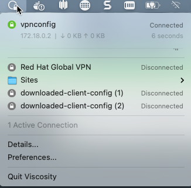

When you configure a Red Hat OpenShift on AWS (ROSA) cluster with a private only configuration, you will need connectivity to this private network in order to access your cluster. This guide will show you how to configute an AWS Client VPN connection so you won't need to setup and configure Jump Boxes.

## Prerequisites

* a private ROSA Cluster
* jq

## Set Envrionment Variables
Start by setting environment variables that we will use to setup the VPN connection
```
export ROSA_CLUSTER_NAME=<rosa cluster name>

export REGION=$(rosa describe cluster -c $ROSA_CLUSTER_NAME  -o json | jq -r .region.id)

export VPN_CLIENT_CIDR=172.16.0.0/16

export PRIVATE_SUBNET_IDS=$(rosa describe cluster -c $ROSA_CLUSTER_NAME -o json | jq -r '.aws.subnet_ids[]')


```

## Create certificates to use for your VPN Connection
There are many ways and methods to create certificates for VPN, the guide below is one of the ways that works well.  Note, that whatever method you use, make sure it supports "X509v3 Extended Key Usage".

1. Clone OpenVPN/easy-rsa

   ```bash
   git clone https://github.com/OpenVPN/easy-rsa.git
   ```

1. Change to the easyrsa directory

   ```bash
   cd easy-rsa/easyrsa3
   ```

1. Initialize the PKI

   ```bash
   ./easyrsa init-pki
   ```

1. Edit certificate parameters

   Uncomment and edit the copied template with your values
   ```bash
   vim pki/vars
   ```

   ```
   set_var EASYRSA_REQ_COUNTRY   "US"
   set_var EASYRSA_REQ_PROVINCE  "California"
   set_var EASYRSA_REQ_CITY      "San Francisco"
   set_var EASYRSA_REQ_ORG       "Copyleft Certificate Co"
   set_var EASYRSA_REQ_EMAIL     "me@example.net"
   set_var EASYRSA_REQ_OU        "My Organizational Unit"
   ```

   Uncomment (remove the #) the folowing field
   ```
   #set_var EASYRSA_KEY_SIZE        2048
   ```

1. Create the CA:

   ```bash
   ./easyrsa build-ca nopass
   ```

1. Generate the Server Certificate and Key

   ```bash
   ./easyrsa build-server-full server nopass
   ```

1. Generate Diffie-Hellman (DH) parameters

   ```bash
   ./easyrsa gen-dh
   ```

1. Generate client credentials

   ```bash
   ./easyrsa build-client-full aws nopass
   ```

1. Set environment variables for the CA certificate you just created.

   ```bash
   CACERT=$(openssl x509 -in pki/ca.crt -outform der | base64)
   ```

## Import certficates into AWS Certificate Manager

1. Import the server certificate

   * Before running the below commands, make sure you are still in the pki directory under the easyrsa3 directory

    ```bash
   SERVER_CERT_ARN=$(aws acm import-certificate --certificate fileb://issued/server.crt --private-key fileb://private/server.key --certificate-chain fileb://ca.crt --region $REGION --query CertificateArn --output text)
    ```

1. Import the client certificate
     ```bash
     CLIENT_CERT_ARN=$(aws acm import-certificate --certificate fileb://issued/aws.crt --private-key fileb://private/aws.key --certificate-chain fileb://ca.crt --region $REGION --query CertificateArn --output text)
    ```

## Create a Client VPN Endpoint

   ```bash
    VPN_CLIENT_ID=$(aws ec2 create-client-vpn-endpoint \
    --client-cidr-block $VPN_CLIENT_CIDR \
    --server-certificate-arn $SERVER_CERT_ARN \
    --authentication-options Type=certificate-authentication,MutualAuthentication={ClientRootCertificateChainArn=$CLIENT_CERT_ARN} \
    --connection-log-options Enabled=false --split-tunnel --query ClientVpnEndpointId --output text)
   ```

   Associate each private subnet with the client VPN endpoint
   
   ```bash
   while IFS= read -r subnet;
   do
      echo "Associcating subnet '$subnet'"
      aws ec2 associate-client-vpn-target-network --subnet-id $subnet --client-vpn-endpoint-id $VPN_CLIENT_ID
   done <<< "$PRIVATE_SUBNET_IDS"
   ```

   Add an ingress authorization rule to a Client VPN endpoint

   ```bash
   aws ec2 authorize-client-vpn-ingress \
    --client-vpn-endpoint-id $VPN_CLIENT_ID \
    --target-network-cidr 0.0.0.0/0 \
    --authorize-all-groups
   ```

## Configure your OpenVPN Client
   ```bash
   aws ec2 export-client-vpn-client-configuration --client-vpn-endpoint-id $VPN_CLIENT_ID --output text>client-config.ovpn
   ```

   * note: make sure you are still in the easy rsa / pki directory.

   ```bash
   echo '<cert>' >> client-config.ovpn
   openssl x509 -in issued/aws.crt >> client-config.ovpn
   echo '</cert>' >> client-config.ovpn
   echo '<key>' >> client-config.ovpn
   cat private/aws.key >> client-config.ovpn
   echo '</key>' >> client-config.ovpn
   ```
## Add DNS Entries
In order to resolve the ROSA Cluster domain name, you will need to either add the DNS server and the Route 53 Hosted Domain for the cluser to your VPN settings or /etc/hosts in machine you are connecting from.

The DNS server will be the x.x.x.2 address of your VPC CIDR.  For example, if you VPC CIDR is 10.66.0.0/16 then your DNS server will be 10.66.0.2

You can find the VPC ( machine ) CIDR with this command:
```
rosa describe cluster -c $ROSA_CLUSTER_NAME -o json | jq -r '.network.machine_cidr'
```

You can find the ROSA base domain with this command:
```
rosa describe cluster -c $ROSA_CLUSTER_NAME -o json | jq -r '.dns.base_domain'
``` 
## Configure your OpenVPN Client
1. Import the client-config.ovpn file into your VPN Software.
* Mac users - just double click the client-config.ovpn and it will be imported automatically into your VPN client.

1. Connect your VPN.


